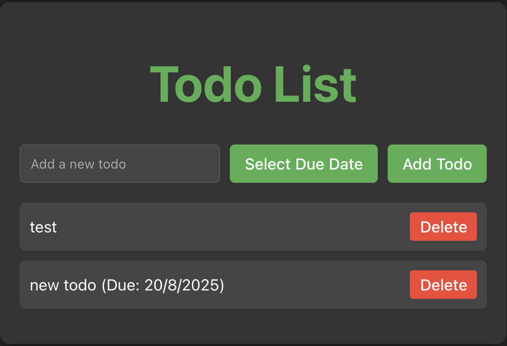
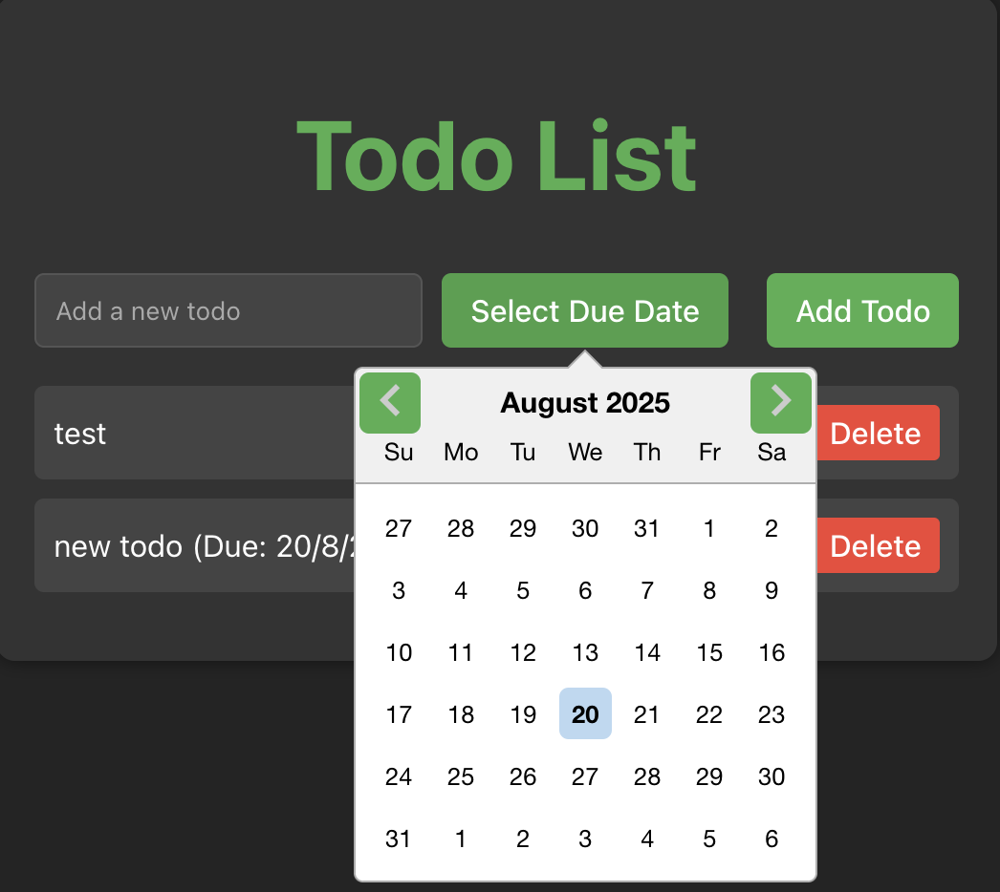

# AI Coding Agent

Coding agent with workspace orchestration.


> 🏗️ WIP

# Features

- Workspace Orchestration: Automatically Create, Archive, Restore Worksapces that the agent will work in.
  - Create: Creates a docker container with an linux image.
  - Archive: Extracts the file system of the container after the agent is done working, compreses it and stores in s3
  - Restore: Gets the workspace file system from s3 and mounts it to a container with the same image
- Agent: Coding agent which hooks into the workspace, writes code.
- Streams live updates to the user via websockets

# Sample agent output:

Prompt: Make a simple todo app in react, add a calender that has a due date.



# Roadmap:

- Real-time collaborative editing in web interface
- Better UI/UX for file tree and terminal
- Migration from Docker to full VMs
- Agent memory, sub-agents, and performance evaluation

# Setup

```bash
pnpm install
docker compose up -d
pnpm dev
```

Note: In active developemnt
